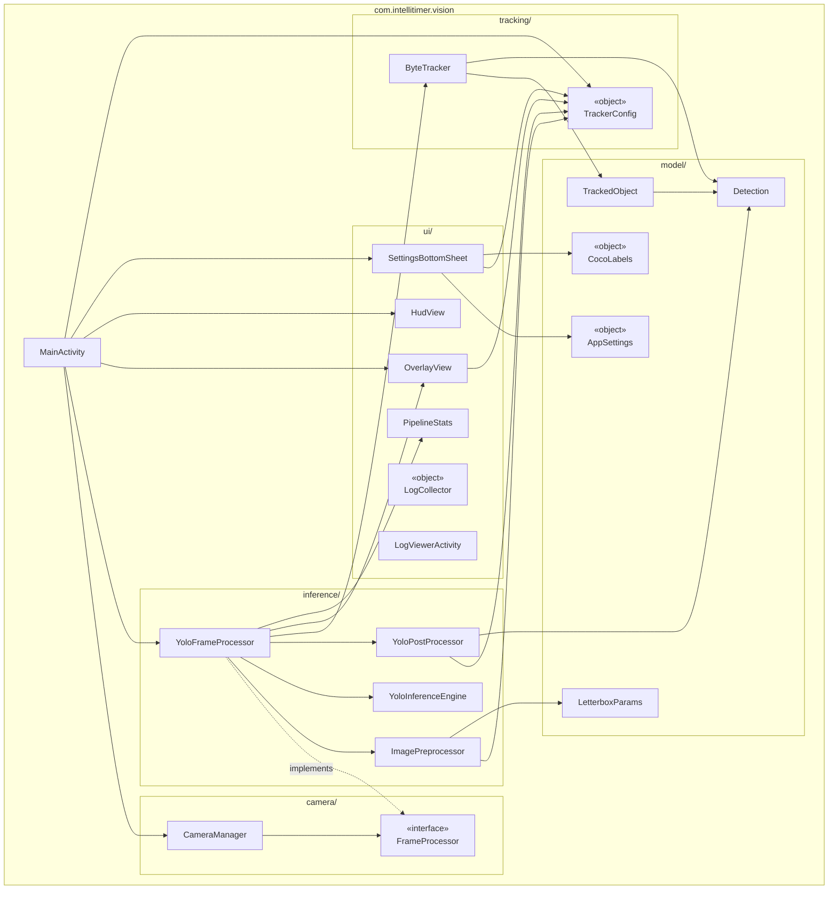
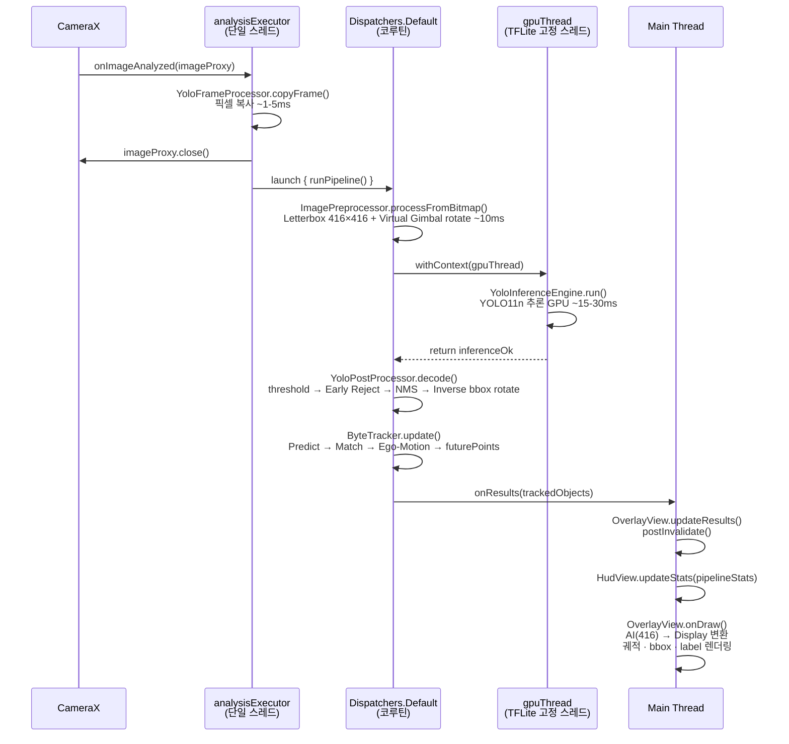
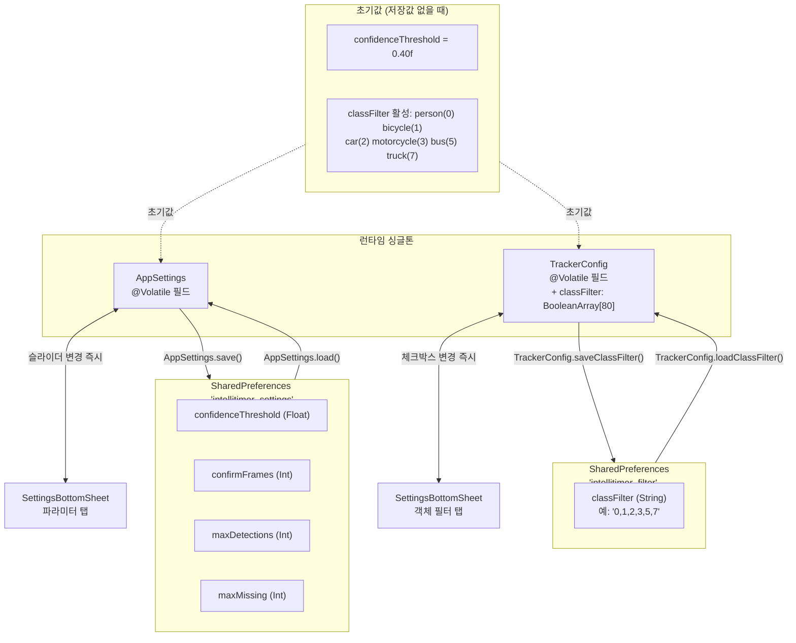
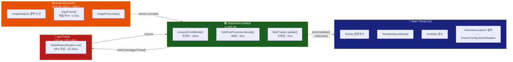
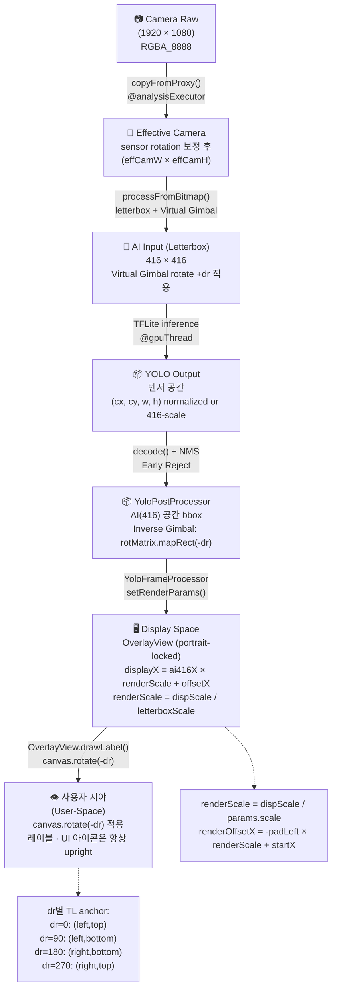

# IntelliTimer — 코드 아키텍처 UML

> Mermaid 다이어그램. GitHub / VSCode Markdown Preview Enhanced 에서 렌더링 가능.

---

## 1. 전체 패키지 구조 (Package Diagram)

---

## 2. 클래스 상세 (Class Diagram)

```mermaid
classDiagram
    %% ── Interfaces ────────────────────────────────────────────────────────────
    class FrameProcessor {
        <<interface>>
        +copyFrame(imageProxy: ImageProxy) Boolean
        +runPipeline() List~TrackedObject~
    }

    %% ── Activity / Entry Point ────────────────────────────────────────────────
    class MainActivity {
        -binding: ActivityMainBinding
        -cameraManager: CameraManager
        -frameProcessor: YoloFrameProcessor
        -mainScope: CoroutineScope
        -orientationListener: OrientationEventListener
        +onCreate()
        +onResume()
        +onPause()
        +onDestroy()
        -startVisionPipeline()
    }

    %% ── Camera Layer ──────────────────────────────────────────────────────────
    class CameraManager {
        -context: Context
        -lifecycleOwner: LifecycleOwner
        -previewView: PreviewView
        -frameProcessor: FrameProcessor
        -onResults: (List~TrackedObject~) → Unit
        -analysisExecutor: ExecutorService
        +start()
        +stop()
    }

    %% ── Inference Pipeline ────────────────────────────────────────────────────
    class YoloFrameProcessor {
        -preprocessor: ImagePreprocessor
        -inferenceEngine: YoloInferenceEngine (lazy)
        -postProcessor: YoloPostProcessor
        -tracker: ByteTracker
        -gpuThread: CoroutineDispatcher
        -overlayView: View?
        +var onStats: (PipelineStats) → Unit?
        +copyFrame(imageProxy) Boolean
        +runPipeline() List~TrackedObject~
        +release()
    }

    class ImagePreprocessor {
        +outputBuffer: ByteBuffer
        +letterboxParams: LetterboxParams
        -letterboxBitmap: Bitmap
        -letterboxCanvas: Canvas
        +copyFromProxy(imageProxy) Boolean
        +processFromBitmap() Boolean
        +release()
    }

    class YoloInferenceEngine {
        +delegateName: String
        -interpreter: Interpreter
        +run(inputBuffer: ByteBuffer) Boolean
        +close()
    }

    class YoloPostProcessor {
        +lastRawCount: Int
        +lastNmsCount: Int
        -rotMatrix: Matrix
        -candXmin/Xmax/Ymin/Ymax: FloatArray
        -candConf/ClassId: FloatArray/IntArray
        +decode(engine: YoloInferenceEngine) List~Detection~
    }

    %% ── Tracking ──────────────────────────────────────────────────────────────
    class ByteTracker {
        -trackPool: Array~TrackedObject~
        -slotActive: BooleanArray
        -nextId: Int
        +update(detections: List~Detection~) List~TrackedObject~
    }

    class TrackerConfig {
        <<object>>
        +matchRadius: Float
        +maxCoastFrames: Int
        +velocityEMA: Float
        +deadZone: Float
        +deviceRotation: Int
        +classFilter: BooleanArray[80]
        +loadClassFilter(context)
        +saveClassFilter(context)
    }

    %% ── Model / Data ──────────────────────────────────────────────────────────
    class Detection {
        +var classId: Int
        +var confidence: Float
        +val rect: RectF
    }

    class TrackedObject {
        +var trackId: Int
        +val detection: Detection
        +var velocityX: Float
        +var velocityY: Float
        +val predictedTrajectory: MutableList~PointF~
        +var invisibleCount: Int
        +var trueVx: Float
        +var trueVy: Float
        +var isMoving: Boolean
        +val futurePoints: Array~PointF~[20]
    }

    class LetterboxParams {
        +var scale: Float
        +var padLeft: Float
        +var padTop: Float
        +var effCamW: Int
        +var effCamH: Int
        +update(...)
    }

    class AppSettings {
        <<object>>
        +confidenceThreshold: Float
        +confirmFrames: Int
        +maxDetections: Int
        +maxMissing: Int
        +load(context)
        +save(context)
    }

    class CocoLabels {
        <<object>>
        -NAMES: Array~String~[80]
        +get(classId: Int) String
    }

    class PipelineStats {
        +delegateName: String
        +fps: Float
        +preprocessMs: Long
        +inferenceMs: Long
        +nmsMs: Long
        +detectionCount: Int
    }

    %% ── UI ───────────────────────────────────────────────────────────────────
    class OverlayView {
        -renderScale: Float
        -renderOffsetX: Float
        -renderOffsetY: Float
        -displayBuffer: ArrayList~TrackedObject~
        +setRenderParams(scale, offsetX, offsetY)
        +updateResults(objects)
        +setDebugInfo(raw, nms)
        -drawFutureTrajectory(canvas, obj)
        -drawTrajectory(canvas, obj, color)
        -drawBoundingBox(canvas, obj, color)
        -drawLabel(canvas, obj, color)
    }

    class HudView {
        -stats: PipelineStats
        +updateStats(stats: PipelineStats)
    }

    class SettingsBottomSheet {
        -checkBoxes: Array~CheckBox?~[80]
        +onViewCreated(view, savedInstanceState)
        -setupParamsPanel(view)
        -setupFiltersPanel(view)
        -selectTab(isParams: Boolean)
    }

    %% ── Relationships ────────────────────────────────────────────────────────
    MainActivity --> CameraManager
    MainActivity --> YoloFrameProcessor
    MainActivity --> OverlayView
    MainActivity --> HudView
    MainActivity --> SettingsBottomSheet
    MainActivity ..> TrackerConfig

    CameraManager --> FrameProcessor
    YoloFrameProcessor ..|> FrameProcessor

    YoloFrameProcessor --> ImagePreprocessor
    YoloFrameProcessor --> YoloInferenceEngine
    YoloFrameProcessor --> YoloPostProcessor
    YoloFrameProcessor --> ByteTracker
    YoloFrameProcessor ..> OverlayView
    YoloFrameProcessor ..> PipelineStats

    ImagePreprocessor --> LetterboxParams
    ImagePreprocessor ..> TrackerConfig

    YoloPostProcessor ..> TrackerConfig
    YoloPostProcessor ..> Detection

    ByteTracker --> TrackedObject
    ByteTracker ..> Detection
    ByteTracker ..> AppSettings
    ByteTracker ..> TrackerConfig

    TrackedObject *-- Detection
    TrackedObject *-- "20" PointF

    OverlayView ..> TrackerConfig
    OverlayView ..> TrackedObject

    SettingsBottomSheet ..> AppSettings
    SettingsBottomSheet ..> TrackerConfig
    SettingsBottomSheet ..> CocoLabels
```

---

## 3. 비전 파이프라인 시퀀스 (Sequence Diagram)

---

## 4. 데이터 흐름 (Data Flow Diagram)

```mermaid
flowchart LR
    CAM["📷 CameraX\nRGBA_8888\n~1920×1080"]

    subgraph Phase2["Phase 2 — 전처리"]
        IP1["copyFromProxy()\nanalysisExecutor"]
        IP2["processFromBitmap()\nDispatchers.Default"]
        GIMBAL["Virtual Gimbal\ncanvas.rotate(+dr, 208, 208)"]
        LB["Letterbox\n416×416"]
        BUF["ByteBuffer\nFloat32\n1×416×416×3"]
    end

    subgraph Phase3["Phase 3 — 추론"]
        TFL["YOLO11n TFLite\nGPU Delegate\ngpuThread"]
        OUT["rawOutput[]\n[1×84×8400]\nor transposed"]
    end

    subgraph Phase4["Phase 4 — 후처리"]
        THR["Confidence\nThreshold\n> 0.30f"]
        ER["Early Reject\nclassFilter[classId]"]
        NMS["NMS\nIoU > 0.45"]
        ROT["Inverse Bbox\nrotMatrix.mapRect()\n-deviceRotation"]
        DETS["List~Detection~\nAI(416) 공간"]
    end

    subgraph Phase5["Phase 5 — 트래킹"]
        BT["ByteTracker\nPredict → Match → Update"]
        EGO["Ego-Motion 보정\ntrueVx/trueVy"]
        FUTURE["futurePoints[20]\n미래 20프레임 예측"]
        TRACKS["List~TrackedObject~\nAI(416) 공간"]
    end

    subgraph Render["렌더링 (Main Thread)"]
        TRANS["AI(416) → Display\ndisplayX = ai416X × renderScale + offsetX"]
        LABEL["레이블\ncanvas.rotate(-dr)\n4-코너 배치"]
        DRAW["OverlayView.onDraw()\n궤적·bbox·레이블"]
    end

    CAM --> IP1 --> IP2 --> GIMBAL --> LB --> BUF
    BUF --> TFL --> OUT
    OUT --> THR --> ER --> NMS --> ROT --> DETS
    DETS --> BT --> EGO --> FUTURE --> TRACKS
    TRACKS --> TRANS --> LABEL --> DRAW
```

---

## 5. 설정 저장 구조 (State / Persistence Diagram)

---

## 6. 스레드 모델 (Thread Model)

---

## 7. 좌표계 변환 흐름 (Coordinate Transform)

---

## 요약: 핵심 설계 결정

| 결정 | 내용 | 이유 |
|---|---|---|
| **Zero-GC** | onDraw 핫 패스 내 new 객체 없음 | GC pause → 프레임 드롭 방지 |
| **AI 공간 격리** | PostProcessor 출력 = 순수 416 좌표 | 단일 책임, 테스트 용이 |
| **Virtual Gimbal** | canvas.rotate(+dr) on letterbox | AI가 항상 upright 이미지 수신 |
| **2-Stage Frame** | copyFrame / runPipeline 분리 | imageProxy.close() 즉시 → 30fps 유지 |
| **GPU 고정 스레드** | gpuThread = 단일 스레드 | TFLite GPU Delegate 스레드 친화성 |
| **BooleanArray 필터** | classFilter[80] | O(1) 조회, GC 없음, Early Reject |
| **Portrait Lock** | Activity 세로 고정 | 좌표계 단순화, OrientationListener로 보정 |
